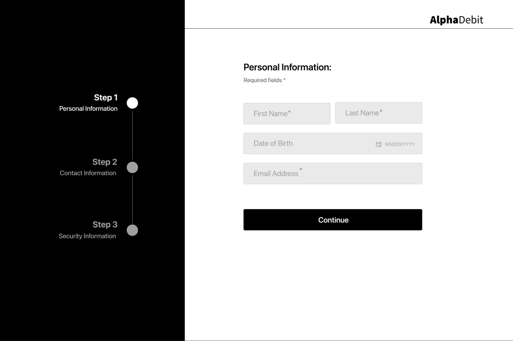
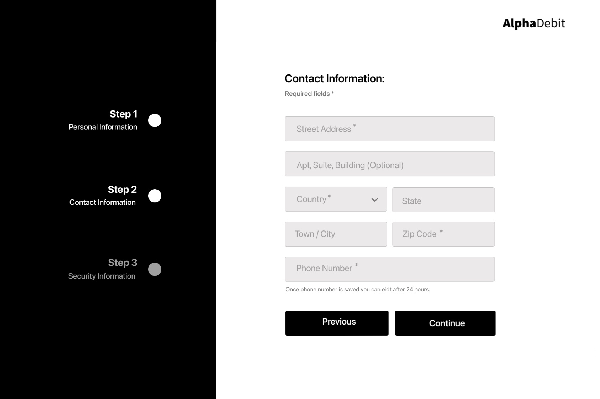
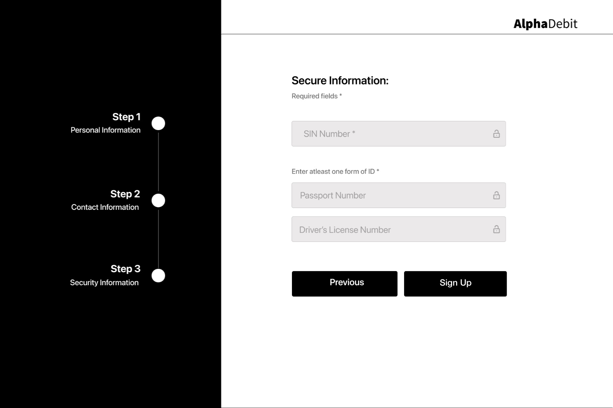

### Authentication API

The candidate is tasked with developing a SignUp Form that emphasizes security and best practices in
software development. This entails creating an API specification using a structured format,
implementing adjustable password policies, and adopting contemporary methods for password storage.
JWT should be utilized for maintaining state persistence across steps. The task also requires
meticulous validation and sanitization of form inputs to prevent security vulnerabilities, alongside
providing clear error messages for better user experience. Data should be stored using LowDB, a
file-based database solution, ensuring simplicity and efficiency. Finally, a comprehensive test
coverage for all endpoints is expected, showcasing the application's reliability and functionality.

## Successful Candidates

- Possess a sharp, analytical mind with a strong mental grasp of complex problems
- Engage deeply with intellectual challenges and exhibit comfort in complex problem-solving
- Efficiently manage, agree and prioritize multiple tasks and viewpoints concurrently
- Excel in autonomous work environments, operating effectively without direct supervision
- Understand and adhere to implicit standards and conventions in all work aspects
- Practice and embody the principle of meticulous attention to detail at all levels
- Consistently prioritize and deliver high-quality, scalable, and performant code
- Have an in-depth understanding of the processes their code influences and controls
- Strongly commit to rigorous testing and quality assurance to ensure product excellence
- Develop and implement comprehensive error handling and logging mechanisms
- Respect and value the perceptions of others in their deliverables and collaboration
- Manage time effectively to respect deadlines and deliver on their own commitments
- Skillfully design and develop respectful and user-friendly application interfaces (FE only)
- Perfectly understand major security threats and thus can build protected systems (BE only)
